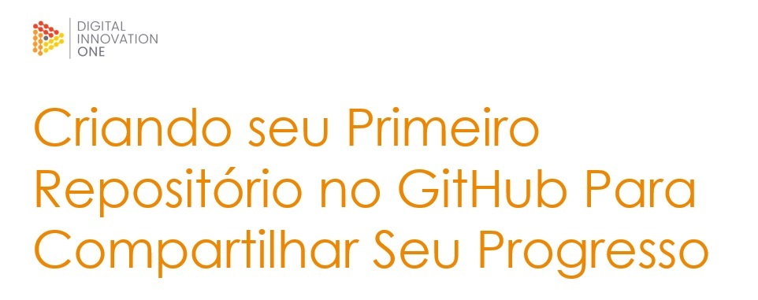

# 				1º DESAFIO DE PROJETO

## Bootcamp Geração Tech Unimed-BH - Ciência de Dados

**Propositor:** Venilton Falvo Jr - Tech Lead na **DIO**

**Autor:** Leopoldo Augusto Paolucci

**Data:** 21/09/2022

**Descrição do Desafio**

Reforce seu conhecimento em Git com um desafio de projeto totalmente  prático, onde você executará todos os passos para a criação, atualização e sincronização de um repositório no GitHub. Para isso, tenha em mente  todas as dicas e direcionamentos apresentados pelo expert nas aulas.  Dessa forma, você poderá compartilhar suas anotações e exercícios em seu próprio repositório. Criando assim, o primeiro (de muitos) projetos do  seu portfólio ;)

**Pré-requisitos:**

- **Conhecimento Básico em Git e GitHub;**
- **Imagem: telaapresentacao.jpg**

**Tecnologias:**

- **Editor Markdown;** 
- **Typora.**

  

