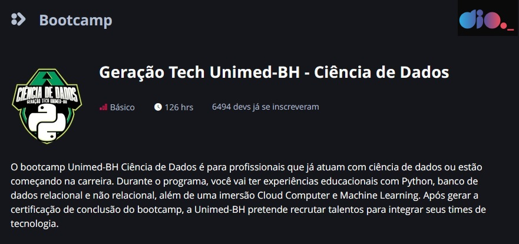

# Bootcamp Geração Tech Unimed-BH - Ciência de Dados

**Instrutor:** Guilherme Carvalho - CEO Oak Solutions **DIO**

**Aluno:** Leopoldo Augusto Paolucci

**Data:** 23/09/2022

**Por que Cientistas de Dados escolhem Python?**

Python é realmente uma grande ferramenta e há várias razões pelas quais os Cientistas de Dados usam Python. Cientistas de Dados precisam criar visualizações de dados para comunicar claramente os resultados e as previsões em qualquer nível de um negócio. Este é o valor real que um grande Cientista de Dados pode fornecer – sem isso, seu trabalho perde valor.

Portanto, nós escolhemos Python não só por causa de sua intensidade computacional – nós também escolhemos Python porque é uma linguagem de programação comum que pode ser encontrada entre equipes diferentes em qualquer empresa. Python se tornou uma linguagem de programação que permite criar um canal direto para a análise de dados.

**Fonte:** https://www.cienciaedados.com/por-que-cientistas-de-dados-escolhem-python/

**Pré-requisitos:**

- **Imagem: telaapresentacaoDIO.jpg**

**Tecnologias:**

- **Editor Markdown;** 
- **Typora.**

  

